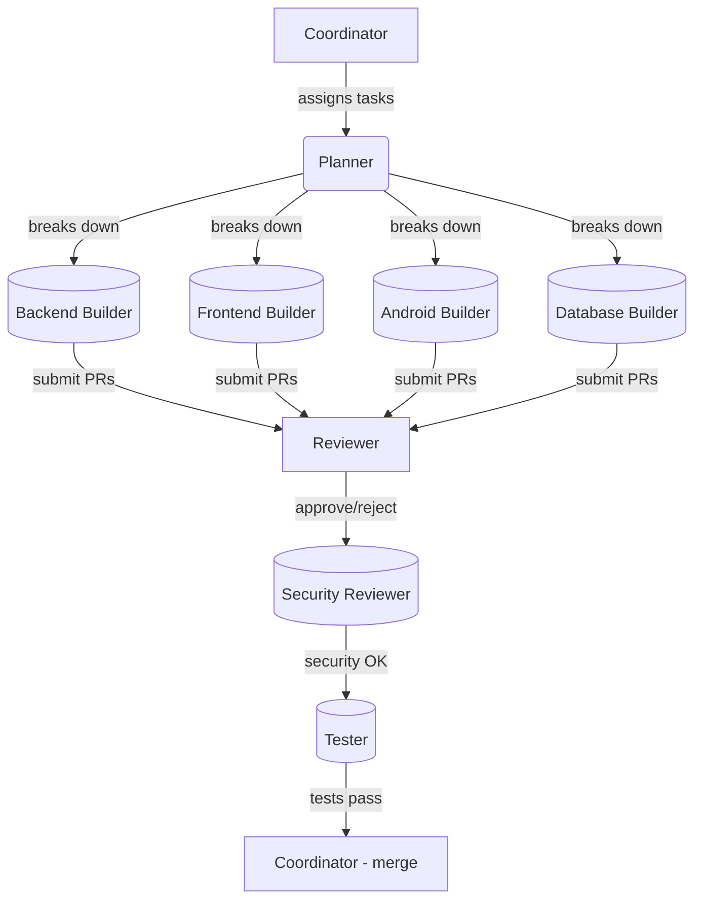

# Agent Orchestration Protocol

## Fleet Management Agent Roles

### Core Agents (Required)
| Agent | Type | Responsibilities |
|-------|------|------------------|
| Coordinator | Orchestrator | Overall project coordination, task delegation |
| Planner | Planner | Task decomposition, sequencing, estimation |
| Backend Builder | Builder | Express server, APIs, business logic |
| Frontend Builder | Builder | React components, state management |
| Android Builder | Builder | Native Android app with Firebase |
| Database Builder | Builder | Schema design, migrations, seeding |
| Reviewer | Reviewer | Code quality, style enforcement |
| Security Reviewer | Reviewer | Security audits, vulnerability checks |
| Tester | Tester | Unit/integration/E2E tests |

### Optional Extensions (Future)
- iOS Builder (iOS app development)
- DevOps Agent (CI/CD pipelines)
- UI Designer (design system creation)
- Documentation Writer (API docs)

## Orchestration Flow

## Task Assignment Protocol

1. **Coordinator** receives user request
2. **Planner** decomposes into atomic tasks
3. Tasks assigned to relevant **Builders**
4. Builders submit code for **Reviewer** approval
5. **Security Reviewer** audits critical components
6. **Tester** validates changes
7. **Coordinator** merges and tracks progress

## Communication Patterns

- **Direct**: Agents can directly query other agents (via context)
- **Asynchronous**: PR-based workflows with review comments
- **Synchronous**: Real-time coordination for blocking tasks

## Conflict Resolution

1. Coordinator mediates conflicting priorities
2. Security issues escalate to immediate freeze
3. Reviewer consensus required for architectural changes